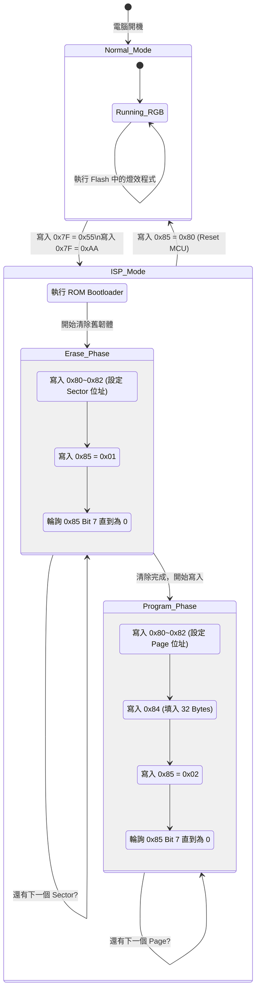

# ENE SMBus ISP 韌體更新架構說明

這份文件詳細解析了 ENE RGB MCU 的 ISP (In-System Programming) 韌體更新機制，並透過方塊圖與流程圖說明底層運作原理。

---

## 1. `ENE_REG_UNLOCK_KEY` (0x7F) 的核心用途

在一般運作狀態下，ENE 晶片正忙著執行 Flash 裡的應用程式（例如不斷計算 PWM 來變換 RGB 呼吸燈）。如果這時允許隨意存取 Flash 控制暫存器，SMBus 上的雜訊或其它監控軟體的誤觸，都可能瞬間毀掉韌體（變磚）。

因此，`ENE_REG_UNLOCK_KEY` 扮演了**「保險箱密碼鎖」與「硬體執行緒切換開關」**的雙重角色：

1. **防呆與防干擾 (Safety Lock)**：必須在 SMBus 上連續對 `0x7F` 寫入特徵碼 `0x55` 與 `0xAA`，晶片內部的狀態機才會承認這是一個合法的 ISP 請求。
2. **切換至 ROM Bootloader (Context Switch)**：收到解鎖碼後，MCU 會產生一個不可遮蔽的中斷 (NMI) 或硬體 Reset，**強制停止當前正在執行的 RGB 燈效程式**。接著，MCU 會把記憶體映射（Memory Mapping）切換到晶片出廠固化的 ROM 唯讀記憶體，並開始執行裡面的 ISP Bootloader 程式，準備接收後續的 Erase 與 Page Write 指令。

---

## 2. 系統架構方塊圖 (Architecture Block Diagram)

下圖展示了 Host 端（你的電腦）如何透過 SMBus 與 ENE 晶片內部的硬體單元進行互動：

```mermaid
blockDiagram
    block Host_PC {
        Windows_OS["Windows OS"]
        Update_Tool["FW Update Tool\n(User Mode)"]
        ENE_Driver["ene.sys\n(Ring 0 Driver)"]
    }
    
    block Motherboard {
        SMBus_Ctrl["Intel/AMD\nSMBus Controller"]
    }
    
    block ENE_MCU["ENE RGB MCU"] {
        SMBus_HW["SMBus I/F\n(Addr: 0x38/0x70)"]
        ISP_Registers["ISP Registers\n(0x7F, 0x80, 0x84, 0x85)"]
        SRAM_Buffer["SRAM Page Buffer\n(32/64 Bytes)"]
        ROM_Bootloader["ROM Bootloader\n(Hardcoded)"]
        Flash_Memory["NV Flash Memory\n(User Application)"]
    }

    Update_Tool --> ENE_Driver : IOCTL
    ENE_Driver --> SMBus_Ctrl : Port I/O
    SMBus_Ctrl --> SMBus_HW : Physical I2C/SMBus
    
    SMBus_HW --> ISP_Registers : Read/Write
    ISP_Registers --> SRAM_Buffer : Cmd 0x84\n(Load Data)
    ISP_Registers --> ROM_Bootloader : Cmd 0x7F\n(Unlock & Execute)
    ROM_Bootloader --> Flash_Memory : Erase / Program
    SRAM_Buffer --> Flash_Memory : Write Page
```

---

## 3. ISP 韌體更新狀態機流程圖 (Firmware Update Flowchart)

以下是軟體端（Update Tool）與硬體端（ENE MCU）在整個韌體更新過程中的互動流程：



---

### 重要防呆提醒

> [!WARNING]
> **變磚危機 (Bricking Risk)**
> 在 `ISP_Mode` 中（特別是 `Wait_Erase` 和 `Wait_Write` 階段），ENE MCU 對時序與指令順序非常敏感。此時若有如 HWiNFO 等軟體在背景發送了其他 SMBus 探測封包，極易導致 ISP 狀態機崩潰。一旦狀態機卡死，未寫完的 Flash 就成了廢磚。
