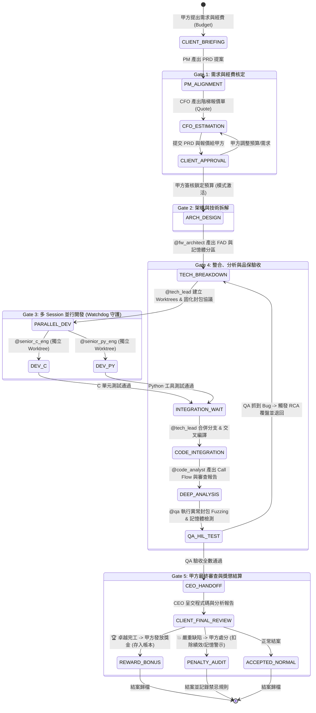

# 🏢 Hermes 嵌入式韌體微型公司協同協定 (HMC-P v8.1)

---

## 📋 1. 公司完整編制與角色清單總表 (Official Company Roster)

本公司共有 **10 大標準角色編制**。任何 AI 在讀取本規範時，可依據下表快速定位自身角色職能、權限與上下游關係：

| 編號 | 角色職稱 (Role Title) | Profile Handle | 職位等級 | 核心職責 (Core Responsibility) | 核心輸入 / 產出物 | 上下游對接人 | 許可工具 (Tools) |
| :---: | :--- | :--- | :---: | :--- | :--- | :--- | :--- |
| **01** | **甲方 (VIP Client / 案主)** | `@client` | 最高決策者 | 需求提出、經費撥款、需求確認簽核、結案審判與獎懲裁決。 | 需求目標 ➔ 經費與簽核令、結案裁決 (`PERFECT_BONUS` / `TERRIBLE_PENALIZE`) | ↔ `@pm` (需求)<br>↔ `@ceo` (獎懲) | 甲方控制台 / CLI |
| **02** | **產品經理 (Product Manager)** | `@pm` | 管理階層 | 對外代表公司與甲方對接，梳理需求邊界，產出 PRD，未獲簽核嚴禁動工。 | 甲方需求 ➔ `specs/PRD-<id>.md` | 上游: `@client`<br>下游: `@cfo`, `@fw_architect` | `file_write`, `kanban_write`, `inbox_send` |
| **03** | **財務長 / 會計精算師 (CFO)** | `@cfo` | 管理階層 | 精算專案 Token 與工程成本，產出加速階梯報價單，依經費切換加速模式，管理金庫帳本。 | PRD 需求 ➔ `quotes/QUOTE-<id>.json`, `ledger.json` | 上游: `@pm`<br>下游: `@tech_lead`, `@ceo` | `file_write`, `kanban_write`, `calculator` |
| **04** | **韌體架構規劃師 (Firmware Architect)** | `@fw_architect` | 專家階層 | 規劃 4 層架構模型、Flash/RAM/OTA 分區、RTOS 任務優先級與 IPC 矩陣。 | PRD ➔ `docs/architecture/FAD-<id>.md`, `specs/memory_map.json` | 上游: `@pm`<br>下游: `@tech_lead` | `file_write`, `kanban_write`, `diagram_gen` |
| **05** | **韌體總工程師 (Firmware Tech Lead)** | `@tech_lead` | 技術指揮 | 固化 C/Python 通訊協議，開闢 Git Worktree，派發子任務，統籌 Merge、交叉編譯與整合測試。 | FAD 架構書 ➔ `specs/protocols/*.json`, 整合編譯產物 `firmware.bin` | 上游: `@fw_architect`<br>下游: 各開發工程師, `@code_analyst` | `git_tool`, `bash_command`, `cmake`, `kanban_write` |
| **06** | **資深 C 韌體工程師 (Senior C Dev)** | `@senior_c_eng` | 執行階層 | 實作底層 Drivers、HAL、FreeRTOS Tasks、ISR（無動態 malloc），撰寫 Unity 單元測試。 | Protocol/HAL Spec ➔ `src/drivers/*.c`, `tests/test_*.c` (Unity) | 上游: `@tech_lead`<br>平行: `@senior_py_eng` | `file_edit`, `bash_command` (Ceedling/GCC) |
| **07** | **資深 Python 工具工程師 (Python Dev)** | `@senior_py_eng` | 執行階層 | 實作上位機 CLI/GUI、Bootloader 燒錄軟體、二進位 Codec (`struct`)、Mock 虛擬硬體測試台。 | Protocol Spec ➔ `tools/*.py`, `tests/test_*.py` (pytest) | 上游: `@tech_lead`<br>平行: `@senior_c_eng` | `file_edit`, `bash_command` (pytest/pip) |
| **08** | **程式碼分析與報告工程師 (Code Analyst)** | `@code_analyst` | 技術作家 | 逆向解析底層代碼，繪製 Call Flow 時序圖，補全 Doxygen，審計記憶體，產出提交給甲方的技術報告。 | Source Code ➔ `docs/reports/PROJECT_AUDIT_<id>.md` (呈交甲方) | 上游: `@tech_lead`<br>下游: `@qa`, `@client` | `grep_search`, `file_read`, `file_write`, `doxygen` |
| **09** | **韌體 QA 驗收工程師 (Firmware QA)** | `@qa` | 品質門禁 | 執行 MISRA-C 靜態掃描、封包 Fuzzing 壓力測試與 Fault-Tolerance 驗證；主持 RCA 錯誤覆盤。 | 整合韌體 ➔ 驗收測試報告, `knowledge/anti_patterns.json` | 上游: `@tech_lead`<br>下游: `@ceo` | `bash_command` (Cppcheck, PyTest), `kanban_write` |
| **10** | **執行長 (CEO / 獎懲執行官)** | `@ceo` | 最高治理 | 全域治理、維護跨 Session 記憶 (`MEMORY.md`)、執行甲方獎懲指令（發放獎金或扣減績效警戒）。 | QA 報告 / 甲方裁決 ➔ 結案發布, 獎懲執行紀錄 | 上游: `@qa`, `@client`<br>下游: 全體 Agent | `kanban_write`, `ledger_write`, `memory_sync` |

---

## 2. 完整專案生命週期狀態機 (State Machine)



---

## 3. 多專案並行與全域資源排程 (Multi-Project Portfolio)

```
                            ┌──────────────────────────────────────────────────────────┐
                            │                 【甲方 (VIP Client / 案主)】               │
                            │  - 同時立項與撥款多個專案 (Project A, B, C...)            │
                            │  - 即時查看《全專案投資組合儀表板 (Portfolio Dashboard)》 │
                            └──────────────┬───────────────────────────▲───────────────┘
                                           │ (多專案需求 & 經費)        │ (專案交付)
                                           ▼                           │
                            ┌──────────────────────────────────────────┴───────────────┐
                            │          【CFO & CEO 全域排程調度中心 (Global Hub)】       │
                            │  - 控管公司全域並行 Session 上限 (e.g. Max 12 Sessions)   │
                            │  - 依經費排定優先級：經費最高者優先搶佔 GPU/Token 算力     │
                            └──────────────┬───────────────────────────┬───────────────┘
                                           │                           │
                   ┌───────────────────────┴──────────┐ ┌──────────────┴───────────────────────┐
                   ▼                                  ▼ ▼                                      ▼
    【專案 A：CAN 閘道器 (高經費 🚀)】              【專案 B：BLE OTA 升級 (標準 ☕)】      【專案 C：馬達 FOC (超頻 ⚡)】
    - 模式: TURBO_ACCELERATED (優先級 8)             - 模式: STANDARD_MODE (優先級 3)          - 模式: ROYAL_OVERDRIVE (優先級 10)
    - 獨立 Worktree: `.worktrees/PROJ-CAN/`          - 獨立 Worktree: `.worktrees/PROJ-BLE/`   - 獨立 Worktree: `.worktrees/PROJ-FOC/`
    - 分配 4 位工程師並行 Session                     - 分配 2 位工程師序列排程                 - 分配 6 位工程師全員壓上
```

---

## 4. 經費等級與公司加速階梯矩陣 (Acceleration Matrix)

| 投資階梯 | 經費係數 | 執行模式 (Execution Mode) | 模型算力配置 (Model Tier) | 並行 Session 數 | 交付速度與專注度 |
| :--- | :--- | :--- | :--- | :--- | :--- |
| **☕ 基礎標準 (Economy)** | 1.0x (基準經費) | `STANDARD_MODE` | 標準高性價比模型 (e.g. 8B/Flash) | 1~2 位工程師序列排隊 | 正常交付，標準 QA 測試 |
| **🚀 超頻極速 (Turbo)** | 1.5x ~ 2.0x | `TURBO_ACCELERATED` | 旗艦思考推理模型 (e.g. 70B/Thinking) | 3~4 位工程師全開並行 | **提速 200%**，多目錄同時開發 |
| **⚡ 皇家至尊 (Overdrive)** | 2.5x 以上 | `ROYAL_OVERDRIVE` | 最高階未量化旗艦 + 深度思考 | 5 位以上全員壓上、全資源搶佔 | **提速 400%**，專屬架構師全程盯盤、雙重 QA Fuzzing 審計 |

---

## 5. 核心資料結構與資料庫 Schema

### (A) 註冊表 (`.hermes/portfolio.json`)
```json
{
  "company_name": "Hermes Firmware Corp",
  "global_concurrency_limit": 12,
  "active_projects": [
    {
      "project_id": "PROJ-001",
      "project_name": "STM32 CAN 閘道器",
      "priority": 10,
      "execution_mode": "ROYAL_OVERDRIVE",
      "approved_budget": 8000,
      "status": "in_qa",
      "progress_percentage": 85
    }
  ]
}
```

### (B) 避坑資料庫 (`.hermes/knowledge/anti_patterns.json`)
```json
{
  "anti_patterns": [
    {
      "id": "ERR-001",
      "trigger_keywords": ["DMA", "UART", "Stack"],
      "title": "DMA Buffer 放在局部變數導致 HardFault",
      "forbidden_pattern": "uint8_t buf[64]; HAL_UART_Receive_DMA(..., buf, 64);",
      "mandatory_solution": "static uint8_t buf[64] __attribute__((aligned(4)));"
    }
  ]
}
```

---

## 6. 工業級防 Timeout 看門狗守護器 (`watchdog_engine.py`)

```python
import asyncio, json, os, subprocess, time
from pathlib import Path

class ResilientWatchdogRunner:
    def __init__(self, sub_id: str, role: str, workspace: Path, timeout: int = 180):
        self.sub_id, self.role, self.workspace, self.timeout = sub_id, role, workspace, timeout
        
    async def run(self, prompt: str) -> bool:
        for attempt in range(3):
            print(f"🛡️ [Watchdog] 啟動 [{self.role}] Session (嘗試 {attempt + 1}/3)...")
            proc = await asyncio.create_subprocess_exec(
                "hermes", "--profile", self.role, "--prompt", prompt, "--cwd", str(self.workspace),
                stdout=asyncio.subprocess.PIPE, stderr=asyncio.subprocess.PIPE
            )
            last_hb = time.time()
            async def monitor():
                nonlocal last_hb
                while True:
                    line = await proc.stdout.readline()
                    if not line: break
                    last_hb = time.time() # 只要有輸出就重置計時器
            
            m_task = asyncio.create_task(monitor())
            while proc.returncode is None:
                await asyncio.sleep(2)
                if proc.returncode is not None: break
                if time.time() - last_hb > self.timeout:
                    print(f"🚨 [Timeout] {self.sub_id} 超過 {self.timeout}s 無響應，強制重啟！")
                    try: proc.kill()
                    except: pass
                    break
            await m_task
            if proc.returncode == 0: return True
        return False
```
