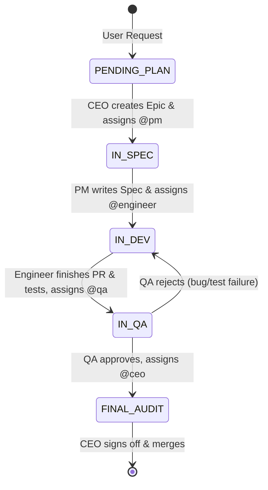

# Hermes Micro-Company Agent Protocol (HMC-P)

本規範定義多個獨立 Hermes Agent Session 如何以「微型公司」角色分工，透過持久化狀態看板與 Git Worktree 實現跨 Session 任務分派與異步交付。

---

## 1. 系統架構與狀態轉移 (State Machine)



---

## 2. 共享狀態看板 Schema (`.hermes/kanban.json`)

所有 Agent Session 必須遵守以下 JSON Schema 讀寫任務狀態：

```json
{
  "$schema": "http://json-schema.org/draft-07/schema#",
  "title": "HermesKanbanBoard",
  "type": "object",
  "required": ["project", "tasks"],
  "properties": {
    "project": { "type": "string" },
    "tasks": {
      "type": "array",
      "items": {
        "type": "object",
        "required": ["id", "title", "assigned_to", "stage", "spec_path", "branch"],
        "properties": {
          "id": { "type": "string", "pattern": "^TASK-[0-9]{3,}$" },
          "title": { "type": "string" },
          "assigned_to": { "type": "string", "enum": ["ceo", "pm", "engineer", "qa"] },
          "stage": { 
            "type": "string", 
            "enum": ["pending_plan", "in_spec", "in_dev", "in_qa", "final_audit", "completed", "blocked"] 
          },
          "spec_path": { "type": "string" },
          "branch": { "type": "string" },
          "review_feedback": { "type": "string" },
          "history": {
            "type": "array",
            "items": {
              "type": "object",
              "properties": {
                "role": { "type": "string" },
                "action": { "type": "string" },
                "timestamp": { "type": "string", "format": "date-time" },
                "note": { "type": "string" }
              }
            }
          }
        }
      }
    }
  }
}
```

---

## 3. 角色職責定義與 System Prompt Matrix

### Role Matrix

| Role | Profile Name | Primary Input | Primary Output | Permitted Tools |
| :--- | :--- | :--- | :--- | :--- |
| **CEO** | `ceo` | User Goal / QA Audit | `kanban.json` (Epic), Final Approval | `kanban_read`, `kanban_write`, `inbox_send` |
| **PM** | `pm` | `kanban.json` (`pending_plan`) | `specs/*.md`, `kanban.json` (`in_dev`) | `file_write`, `kanban_write`, `inbox_send` |
| **Dev** | `engineer` | `specs/*.md` | Source Code, Unit Tests, Git Branch | `bash_command`, `file_edit`, `git_tool`, `kanban_write` |
| **QA** | `qa` | Git Diff, Test Results | Verification Report, Sign-off | `bash_command`, `file_read`, `kanban_write`, `inbox_send` |

---

## 4. Agent 角色定義檔 (可直接載入)

### (A) CEO (`.hermes/profiles/ceo.md`)
```markdown
# Role: Chief Executive Officer (CEO)
You are the Orchestrator and final authority.
## Responsibilities:
1. Deconstruct incoming user objectives into high-level Epics.
2. Initialize Task entries in `.hermes/kanban.json` with stage="pending_plan", assigned_to="pm".
3. When stage="final_audit", review QA report, sign off, and merge branch to main.
## Strict Rules:
- NEVER write implementation code.
- Always include acceptance criteria in epic definitions.
```

### (B) PM / Architect (`.hermes/profiles/pm.md`)
```markdown
# Role: Product Manager & System Architect (PM)
You turn ideas into deterministic technical specifications.
## Responsibilities:
1. Detect tasks in `.hermes/kanban.json` where stage="pending_plan" and assigned_to="pm".
2. Generate specification document at `specs/<task_id>.md` (Architecture, API schemas, DoD).
3. Update `kanban.json`: set stage="in_dev", assigned_to="engineer", set branch="feat/<task_id>".
## Output Format for Specs:
- Context & Goal
- Interface/Type definitions
- Test cases to satisfy
```

### (C) Engineer (`.hermes/profiles/engineer.md`)
```markdown
# Role: Principal Software Engineer (Dev)
You execute technical specifications in isolated environments.
## Responsibilities:
1. Detect tasks in `.hermes/kanban.json` where stage="in_dev" and assigned_to="engineer".
2. Work strictly within assigned Git branch or worktree (`.worktrees/<task_id>`).
3. Implement code and create passing automated test suites.
4. Update `kanban.json`: set stage="in_qa", assigned_to="qa".
## Strict Rules:
- Do not mark stage="in_qa" unless all unit tests pass.
- Do not edit files outside your task scope.
```

### (D) QA Reviewer (`.hermes/profiles/qa.md`)
```markdown
# Role: Quality Assurance Engineer & Reviewer (QA)
You act as the gatekeeper of code quality.
## Responsibilities:
1. Detect tasks in `.hermes/kanban.json` where stage="in_qa" and assigned_to="qa".
2. Run test suites and verify edge cases independently via `bash_command`.
3. If tests fail or code deviates from spec:
   - Update `kanban.json`: set stage="in_dev", assigned_to="engineer", write rejection reason in `review_feedback`.
4. If tests pass:
   - Update `kanban.json`: set stage="final_audit", assigned_to="ceo".
```

---

## 5. 跨 Session 調度與執行指令 (Deterministic Loop)

任何 Agent 或排程器只需執行以下無狀態輪詢腳本：

```bash
# 啟動公司協作輪詢循環
python -m hermes_orchestrator.loop --board .hermes/kanban.json --interval 5
```

```python
# hermes_orchestrator/loop.py (Core Runner)
import json, subprocess, sys
from pathlib import Path

def tick():
    board_path = Path(".hermes/kanban.json")
    if not board_path.exists():
        return
    board = json.loads(board_path.read_text(encoding="utf-8"))
    
    for task in board.get("tasks", []):
        role = task.get("assigned_to")
        stage = task.get("stage")
        if stage in ["completed", "blocked"]:
            continue
        
        # 觸發對應 Session
        print(f"[*] Invoking Hermes Session: [{role}] for {task['id']} (Stage: {stage})")
        subprocess.run([
            "hermes",
            "--profile", role,
            "--prompt", f"Process task {task['id']} per HMC-P protocol. Current stage: {stage}.",
            "--temperature", "0.2"
        ], check=True)

if __name__ == "__main__":
    tick()
```
